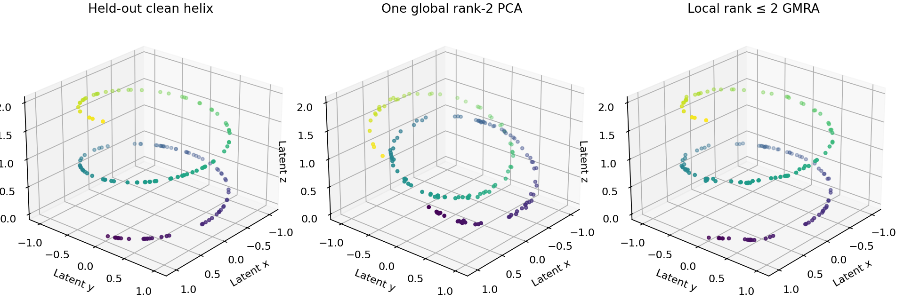

# Geometric Multi-Resolution Analysis

A research implementation of Geometric Multi-Resolution Analysis (GMRA) for
building multiscale approximations of high-dimensional point clouds.



## Reproduce the actual multiscale pipeline

```bash
# Python 3.11, CPU; no PyTorch, datasets, accounts, or GPU required
python -m pip install -r requirements-reproduce.txt
OPENBLAS_NUM_THREADS=1 python -m pytest -q
OPENBLAS_NUM_THREADS=1 python reproduce.py
```

The experiment embeds a noisy helix in 12 dimensions, fits on 300 points, and
reconstructs **150 independently sampled held-out points** per seed. Global PCA
and local models each use at most two basis directions. Results are measured
against the clean held-out coordinates, used only for evaluation.

| Seed | Global rank-2 PCA RMSE | GMRA, leafsize 8 | GMRA, leafsize 24 | GMRA, leafsize 64 |
|---:|---:|---:|---:|---:|
| 7 | 0.14047 | 0.01342 | 0.00915 | 0.03258 |
| 19 | 0.13820 | 0.01309 | 0.01418 | 0.02446 |
| 41 | 0.13206 | 0.01175 | 0.01308 | 0.01696 |

This illustrates the value of local geometry on a curved manifold, **not a
matched-storage compression benchmark**: GMRA stores multiple centers/bases and
leaf identities, while global PCA stores one model. Leafsize is a tree-building
parameter, not a guarantee of equally sized partitions. All tested settings are
reported, without selecting the best using held-out scores.

[Numerical results](results/metrics.json) include the independent reconstruction
check: wavelet inverse versus direct leaf-affine projection differs by at most
2.6e-12 in this experiment. The near-zero wavelet cutoff retains the relevant
directions; larger cutoffs intentionally introduce additional approximation.

## Repairs behind the result

- Replaced unreachable/broken randomized-PCA branches with a seeded, stabilized
  range finder; consistently return truncated `(U, s, Vh)` for tall and wide data.
- Standardized local geometry: samples are rows, centers are `(features,1)`,
  bases are `(rank,features)`. The legacy `inverse` flag is accepted but no longer
  changes that convention. Size and radius now refer to samples, not features.
- Corrected the inverse wavelet recurrence: subtract the parent projection of
  the accumulated detail instead of adding it a second time.
- Preserve affine displacement even for rank-zero leaves; handle a single root
  and empty inference batches. Refitting rejects data that do not match the
  cover tree's rows and ordering.
- Added optional `random_state` to cover-tree construction and removed the
  unconditional PyTorch import from core utilities.

**59 tests pass**, including six new reconstruction/PCA tests. The earlier 53
tests primarily covered cover-tree queries; passing them alone did not validate
the GMRA transform. CI now runs the full suite and regenerates this experiment.

## What is here

- `src/covertree.py` — metric cover tree and nearest-neighbor operations.
- `src/dyadictree.py` — multiscale partition construction.
- `src/wavelettree.py` — local affine models and wavelet transforms.
- `experiments/` — classification and image-dataset studies.
- `tests/` — numerical tests for the core tree operations.
- `COMPREHENSIVE_GMRA_EXPLANATION.tex` — mathematical background and design notes.

This is research code, not a packaged production library. Several experiments
require large external datasets and additional machine-learning dependencies.

## Quick start

```bash
git clone https://github.com/takakhoo/geometric-multiresolution-analysis.git
cd geometric-multiresolution-analysis
python -m venv .venv
source .venv/bin/activate  # Windows: .venv\Scripts\activate
python -m pip install numpy scipy pytest
python -m pytest -q
```

## Minimal example

```python
import numpy as np
from scipy.spatial.distance import euclidean

from src.covertree import CoverTree
from src.dyadictree import DyadicTree

rng = np.random.default_rng(7)
samples = rng.standard_normal((500, 32))
cover_tree = CoverTree(samples, euclidean, leafsize=10, random_state=7)
gmra = DyadicTree(
    cover_tree,
    X=samples,
    manifold_dims=6,
    max_dim=12,
    thresholds=0.5,
    precisions=1e-2,
)
coefficients, leaf_indices = gmra.transform(samples)
reconstructed = gmra.inverse_transform((coefficients, leaf_indices))
```

## Experiment dependencies

The experiment folders cover MNIST, CIFAR-10, medical imaging, and classifier
comparisons. Install only the dependencies needed for the experiment you plan
to run; common additions include PyTorch, scikit-learn, pandas, Matplotlib,
Hydra, and TensorBoard. CUDA can accelerate larger image experiments but is not
required by the core tree implementation.

## Validation

The core suite exercises nearest-neighbor queries, ball queries, pair queries,
neighbor counting, and sparse distance matrices:

```bash
python -m pytest -q
```

The current suite contains **59 passing tests**, including direct checks of
held-out reconstruction and randomized-SVD branches.

## Limitations

- Experiment scripts are exploratory and do not share one locked runtime.
- Dataset paths and compute requirements vary by experiment.
- Benchmark claims should be reproduced in a controlled environment before
  drawing performance conclusions.
- Historical image/classification notebooks and legacy batch/embedding helpers
  have not been revalidated by the bounded helix experiment. Disk-backed PCA
  shelves explicitly raise `NotImplementedError` instead of entering broken code.

## Acknowledgments

The cover-tree tests retain their original SciPy-style copyright notices. See
individual source files for attribution and licensing notes.
